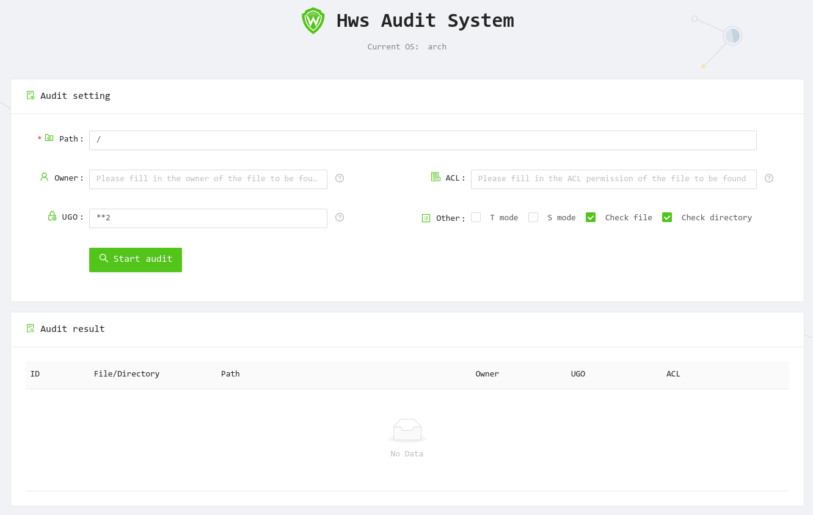

### 介绍
Go语言开发的Linux下的权限审计工具，欢迎PR。

### 前端

### 命令行选项默认值
如果某位不写，则为默认值
- `-C 默认值 "file"`
- `-d 默认值 "./"`
- `-u 默认值 "*" 匹配所有`
- `-m 默认值 "*" 匹配所有`
- `-a 默认值 " " 默认为空代表不检查，* 和 *:* 代表匹配所有`
- `-s 默认值 false`
- `-t 默认值 false`

### 获取帮助
- `./hwsaudit` or `./hwsaudit help [command]`
- 你还可以将输出结果扔给`fzf`,以供选择
